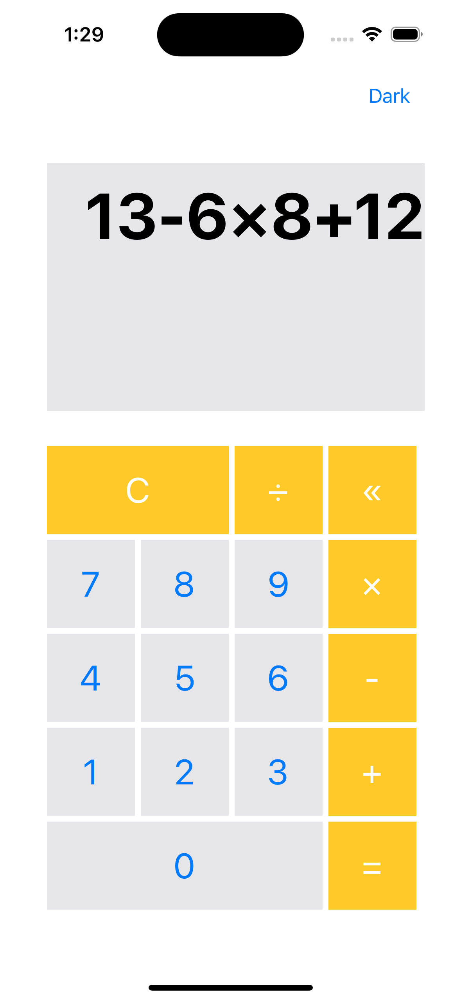
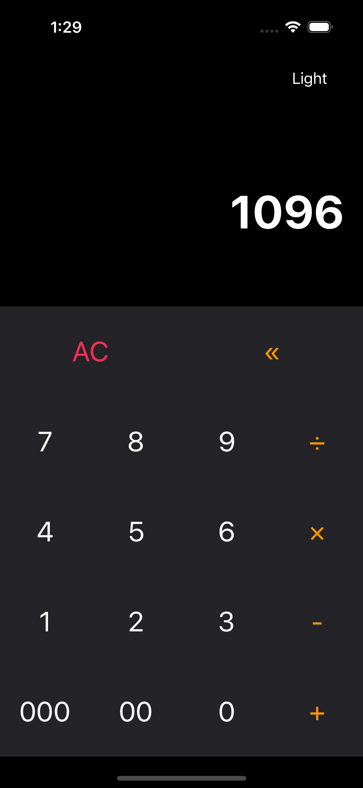

# OnePlusOne

OnoPlusOne은 개인 토이 프로젝트로, 계산기 기능을 지원하는 앱입니다. 앱은 두 가지 버전인 라이트 모드와 다크 모드로 제공되며, 각각 다른 컨셉과 기능을 제공합니다. OnePlusOne을 사용하면 사용자는 라이트 모드와 다크 모드를 자유롭게 전환하여 선호에 맞게 사용할 수 있으며, 복잡한 수식을 해결하거나 신속한 계산을 수행하는 데 필요한 도구를 제공합니다.

 

## 📌 프로젝트 소개

- 프로젝트명: OnePlusOne
- 기간: 2023. 04. 05 ~ 2023. 04. 09 (약 4일)
- 멤버: 신기범

 

## 💡 구현 기능

**1. Light Mode**

  

라이트 모드에서는 복잡한 계산을 수월하게 할 수 있도록 가시성과 사용 편의성을 우선시합니다. 사용자는 긴 수식을 입력하고, 앱은 즉시 결과를 계산하여 나타냅니다. 이 모드는 복잡한 수학적 표현도 간편하게 처리할 수 있습니다.

 

**2. Dark Mode**

  

다크 모드는 전체 식을 표시하지 않고도 빠른 계산이 가능하도록 설계되었습니다. 사용자가 값을 입력하면 앱이 즉시 결과를 계산하며, 빠른 계산을 위해 프로세스를 간소화했습니다. 또한, 다크 모드에는 천(1000)과 백(100) 값을 간편하게 입력할 수 있도록 '000'과 '00' 버튼이 추가되어 있습니다.

 

## 🛠️ 기술 스택

- iOS, Swift, UIKit, StoryBoard

 
