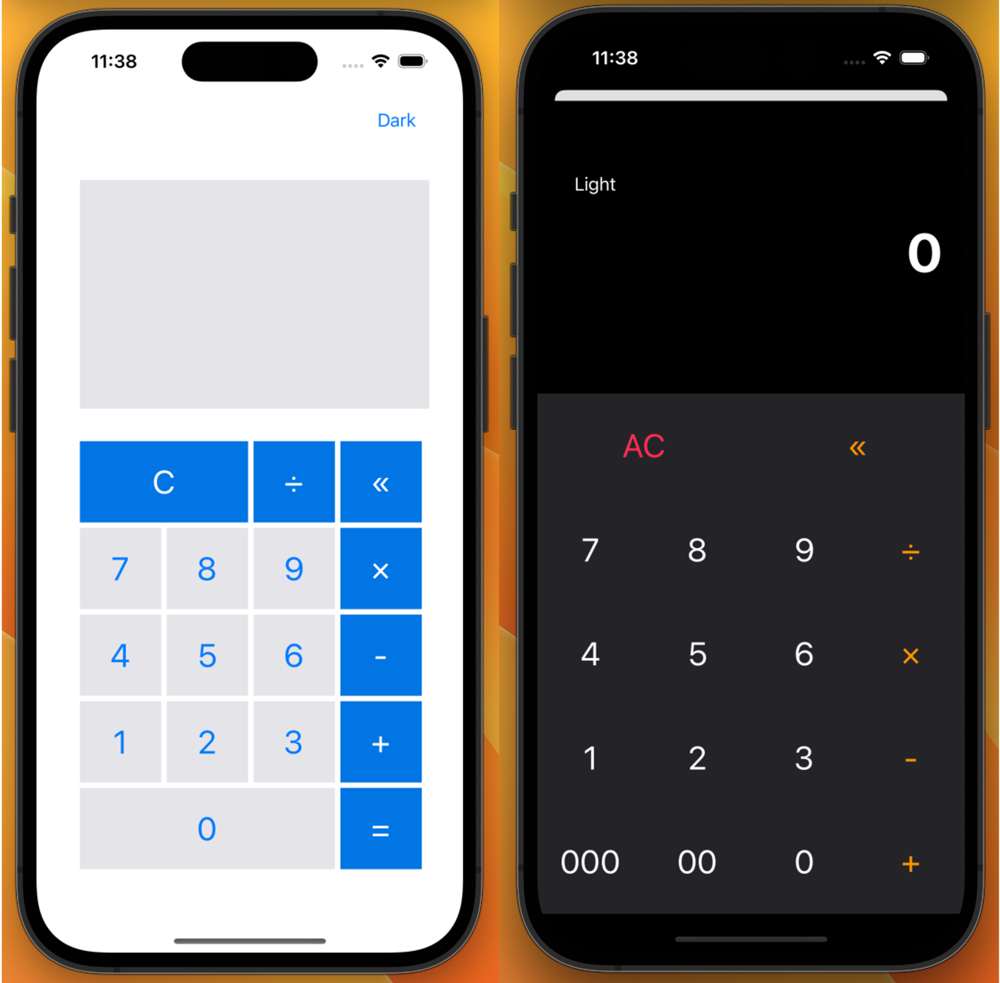

# Calculator

> 20230405~20230409  
> My First Toy Project

 

## APP Logo

> 

 

## APP Image

> 

 

## Development environment

> - Swift
> - StoryBoard
> - UIKit

 

## Project Introduce

> 계산기 앱을 만들었다.
> 두 가지 버전으로 구분했고, Light 모드와 Dark 모드라는 컨셉으로 구현해 보았다.

> 두 버전에서는 UI뿐만 아니라 기능에서도 차이가 있다. Light 모드는 수식이 길어도 한 번에 계산되도록 구현했으며, 입력한 수식이 보이도록 디스플레이에 나타난다. 반면 Dark 모드는 별도 수식 없이 입력한 값을 바로바로 계산해 주도록 구현했다. 또한 Dark 모드에서는 '000'과 '00' 버튼을 만들어 천(1000)과 백(100)을 손쉽게 입력할 수 있도록 하였다.

 

## Developer's words

> 개발을 시작하기 전, 쉽게 생각하여 금방 끝낼 줄 알았다. 그런데 내 생각보다 구현하기가 쉽지 않았다.  
> 특히 수식을 한 번에 처리할 때, 연산 규칙에 맞게 처리하도록 구현하는 것과 결괏값 이후에 과정을 어떻게 처리할지가 가장 시간을 많이 잡았다.
> 이 과정을 해결해 나가면서 개발할 때 그 로직이 정말 중요한 거라는 것을 깨달았다.
